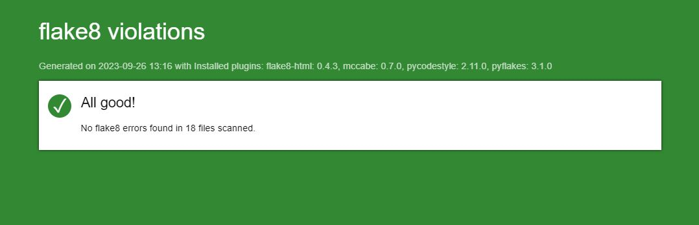

<h1 align="center">Développez un programme logiciel en Python</h1>

    
    
    

# A propos du projet

***Livrable du Projet 4 du parcours D-A Python d'OpenClassrooms : Développez un programme logiciel en Python***

_Testé sous Windows 10 - Python version 3.12.3_

## Table des matières

1. [Initialisation du projet](#id-section1)
    1. [Windows](#id-section1-1)
    2. [MacOS et Linux](#id-section1-2)
    3. [Générer un rapport flake8](#id-section1-3)
2. [Options des menus](#id-section2)
    1. [Menu principal](#id-section2-1)
    2. [Menu des tournois](#id-section2-2)
    3. [Menu des joueurs](#id-section2-3)
    4. [Menu des rapports](#id-section2-4)

## 1. Initialisation du projet

#### i. Windows :
Dans Windows Powershell, naviguer vers le dossier souhaité.
###### Récupération du projet

    $ git clone https://github.com/Gaiden92/P4OC.git

###### Activer l'environnement virtuel
    $ cd P4OC
    $ python -m venv env
    $ ~env\scripts\activate
    
###### Installer les paquets requis
    $ pip install -r requirements.txt

###### Lancer le programme
    $ python main.py

---------

#### II. MacOS et Linux :
Dans le terminal, naviguer vers le dossier souhaité.
###### Récupération du projet

    $ git clone https://github.com/Gaiden92/P4OC.git

###### Activer l'environnement virtuel
    $ cd P4OC 
    $ python3 -m venv env 
    $ source env/bin/activate
    
###### Installer les paquets requis
    $ pip install -r requirements.txt

###### Lancer le programme
    $ python3 main.py

----------

#### III. Générer un rapport flake8

    $ flake8 --format=html --htmldir=flake8_report

**Vous trouverez le rapport dans le dossier _'flake8-report'_.**

_Dernier rapport exporté :_

## 2. Option des menus

#### I. Menu principal

#### II. Menu des tournois

#### III. Menu des joueurs

#### IV. Menu des rapports

###### Exemples de rapports :

